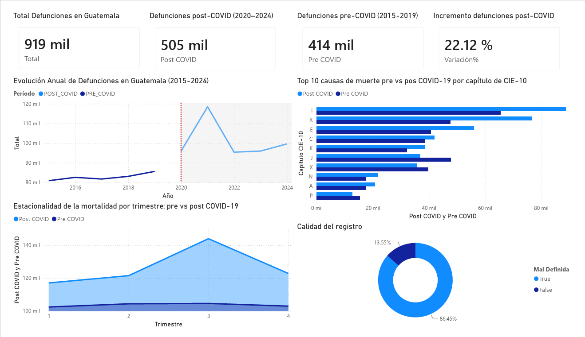
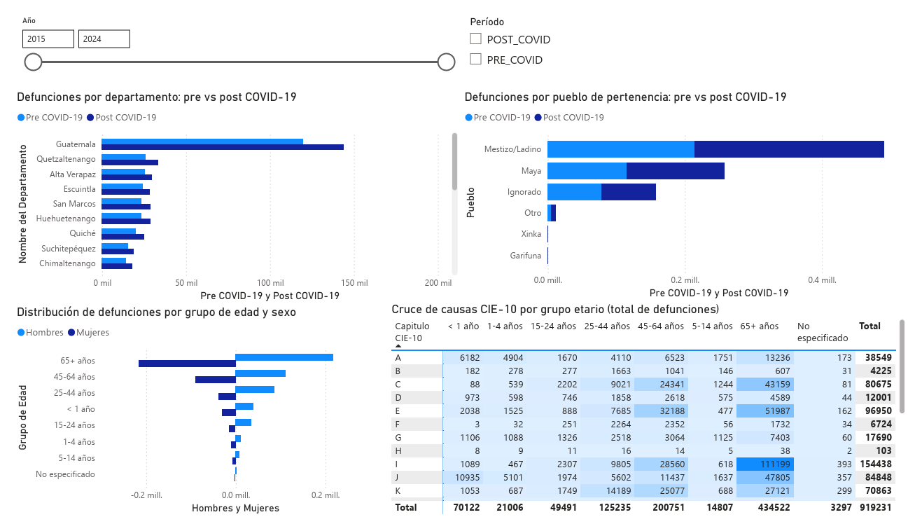
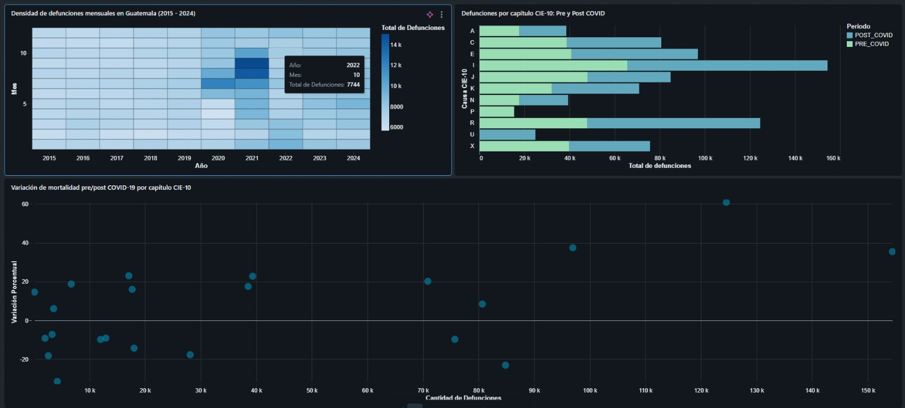
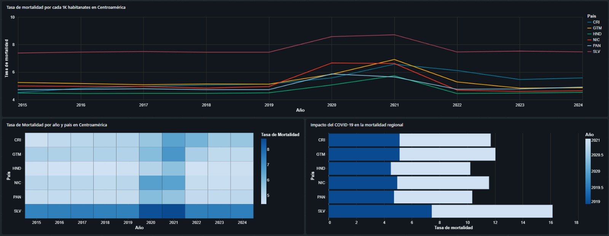

# Visualización e Interoperabilidad BI

## Estrategia de Visualización

El encargo exige demostrar **interoperabilidad real entre herramientas de BI**, no solo la existencia de dos gráficas independientes. La estrategia adoptada conecta ambas herramientas al mismo repositorio analítico (Data Warehouse), de modo que cualquier actualización en el DW se refleja en ambas plataformas sin duplicación de lógica de transformación.

| Herramienta | Vistas entregadas | Fuente de datos |
|---|---|---|
| **Power BI** | 2 dashboards (Power Query + DAX) | Conexión directa al DW |
| **Databricks SQL Editor** | 2 dashboards | Conexión directa al DW |

---

## Power BI

### Preparación de datos — Power Query

Power Query se utiliza como capa de transformación ligera dentro de Power BI. Las transformaciones pesadas (limpieza, modelado dimensional) ya ocurrieron en las capas Stage y Gold del pipeline de Databricks; Power Query solo realiza ajustes de presentación:

- Selección de columnas relevantes para cada vista.
- Tipado explícito de fechas y categorías.
- Creación de columnas calculadas de apoyo (p. ej. etiqueta `"Pre-COVID"` / `"Post-COVID"` a partir del año).

### Medidas DAX

Las medidas analíticas centrales se definen en DAX para aprovechar el motor de cálculo columnar de Power BI:

```dax
-- Total de defunciones en el período seleccionado
Total Defunciones = SUM(fact_defunciones[total_defunciones])

-- Tasa de variación entre períodos
Variación % Pre-Post COVID =
VAR pre  = CALCULATE([Total Defunciones], dim_tiempo[periodo] = "Pre-COVID")
VAR post = CALCULATE([Total Defunciones], dim_tiempo[periodo] = "Post-COVID")
RETURN DIVIDE(post - pre, pre, BLANK())

-- Defunciones por capítulo CIE-10 (top causas)
Defunciones por Capítulo =
CALCULATE(
    [Total Defunciones],
    ALLEXCEPT(fact_defunciones, dim_causa[capitulo_1])
)
```

### Vista 1 — Análisis Comparativo Pre/Post-COVID por Causa

Comparativa de mortalidad entre los dos períodos desagregada por capítulo CIE-10, con énfasis en el capítulo U (COVID-19 directo) y el capítulo J (enfermedades respiratorias generales). Incluye gráfico de barras agrupadas, tabla de variación porcentual y filtros por departamento y año.



### Vista 2 — Tendencia Mensual y Exceso de Mortalidad

Serie de tiempo de defunciones mensuales observadas vs. defunciones esperadas según el modelo Ridge, con área sombreada para el exceso o déficit. Permite identificar visualmente el valor atípico de mayo de 2024 y el patrón de normalización post-pandemia en 2023.



---

## Databricks SQL Editor

Las dos vistas adicionales se construyen directamente sobre el **editor de visualizaciones nativo de Databricks** (Databricks SQL Editor), ejecutando consultas sobre el mismo DW. Esto constituye la demostración de interoperabilidad: **la misma fuente de verdad, dos plataformas distintas**.

### Vista 3 — Mortalidad en Guatemala (2015–2024)

Dashboard con tres visualizaciones sobre `workspace.ml.dataset_mensual_depto_causa`:

**Mapa de calor de defunciones mensuales** — distribución mes × año. El pico más oscuro corresponde a octubre de 2022 (7,744 defunciones), evidenciando el efecto rezagado de la pandemia en la mortalidad guatemalteca.

```sql
SELECT 
  anio,
  mes,
  SUM(defunciones) AS total_defunciones
FROM workspace.ml.dataset_mensual_depto_causa
GROUP BY anio, mes
ORDER BY anio, mes
```

**Barras horizontales Pre/Post-COVID por capítulo CIE-10** — compara el volumen total de defunciones por capítulo entre ambos períodos. Los capítulos con mayor volumen absoluto son I (enfermedades del sistema circulatorio) y R (síntomas y signos no clasificados).

```sql
SELECT 
  capitulo_1,
  periodo,
  SUM(defunciones) AS total_defunciones
FROM workspace.ml.dataset_mensual_depto_causa
GROUP BY capitulo_1, periodo
ORDER BY total_defunciones DESC
LIMIT 20
```

**Diagrama de dispersión de variación porcentual** — cruza el volumen total de defunciones (eje X) contra la variación porcentual pre/post COVID (eje Y) por capítulo CIE-10. Los capítulos con mayor variación positiva corresponden a causas directamente vinculadas al COVID-19 o a disrupciones en la atención médica durante la pandemia.

```sql
SELECT
  capitulo_1,
  SUM(CASE WHEN periodo = 'PRE_COVID' THEN defunciones ELSE 0 END) AS pre_covid,
  SUM(CASE WHEN periodo = 'POST_COVID' THEN defunciones ELSE 0 END) AS post_covid,
  SUM(defunciones) AS total,
  ROUND(
    (SUM(CASE WHEN periodo = 'POST_COVID' THEN defunciones ELSE 0 END) -
     SUM(CASE WHEN periodo = 'PRE_COVID' THEN defunciones ELSE 0 END)) /
    NULLIF(SUM(CASE WHEN periodo = 'PRE_COVID' THEN defunciones ELSE 0 END), 0) * 100, 2
  ) AS variacion_pct
FROM workspace.ml.dataset_mensual_depto_causa
GROUP BY capitulo_1
ORDER BY total DESC
```



### Vista 4 — Comparativa Regional Centroamérica

Dashboard con tres visualizaciones sobre `workspace.dw.fact_indicador_pais_anio`, usando el indicador `SP.DYN.CDRT.IN` (tasa de mortalidad cruda por cada 1,000 habitantes, Banco Mundial):

**Serie temporal por país** — líneas 2015–2024 para CRI, GTM, HND, NIC, PAN y SLV. Se observa un incremento generalizado en 2020–2021 con posterior descenso hacia niveles prepandemia.

```sql
SELECT
  pais_iso3,
  anio,
  ROUND(AVG(valor), 2) AS tasa_mortalidad
FROM workspace.dw.fact_indicador_pais_anio
WHERE anio BETWEEN 2015 AND 2024
  AND indicador_codigo = 'SP.DYN.CDRT.IN'
GROUP BY pais_iso3, anio
ORDER BY pais_iso3, anio
```

**Mapa de calor países × años** — refuerza la lectura anterior en formato matricial. Nicaragua (NIC) y El Salvador (SLV) presentan consistentemente las tasas más altas de la región.

*(Misma consulta que la serie temporal.)*

**Barras apiladas impacto COVID (2019 vs. 2021)** — compara la tasa de mortalidad de 2019 (línea base prepandemia) contra 2021 (pico pandémico) para cada país. El Salvador registra el mayor incremento absoluto entre ambos años.

```sql
SELECT
  pais_iso3,
  anio,
  ROUND(AVG(valor), 2) AS tasa_mortalidad
FROM workspace.dw.fact_indicador_pais_anio
WHERE indicador_codigo = 'SP.DYN.CDRT.IN'
  AND anio IN (2019, 2021)
GROUP BY pais_iso3, anio
HAVING tasa_mortalidad IS NOT NULL
ORDER BY pais_iso3, anio
```



---

## Demostración de Interoperabilidad

!!! success "Criterio de interoperabilidad"
    La interoperabilidad no se demuestra con capturas de pantalla: en la defensa oral se ejecuta en vivo la actualización de datos en el DW y se muestra cómo ambas herramientas reflejan el cambio sin intervención manual adicional.

El flujo completo de interoperabilidad es:


Ambas conexiones apuntan al mismo esquema del DW. No existe una copia intermedia de datos ni una exportación manual entre herramientas.