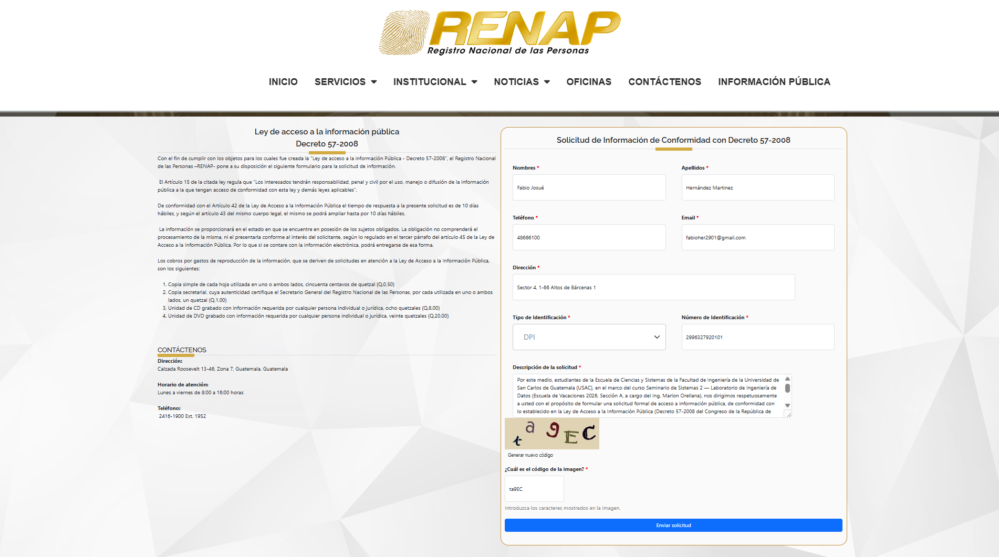
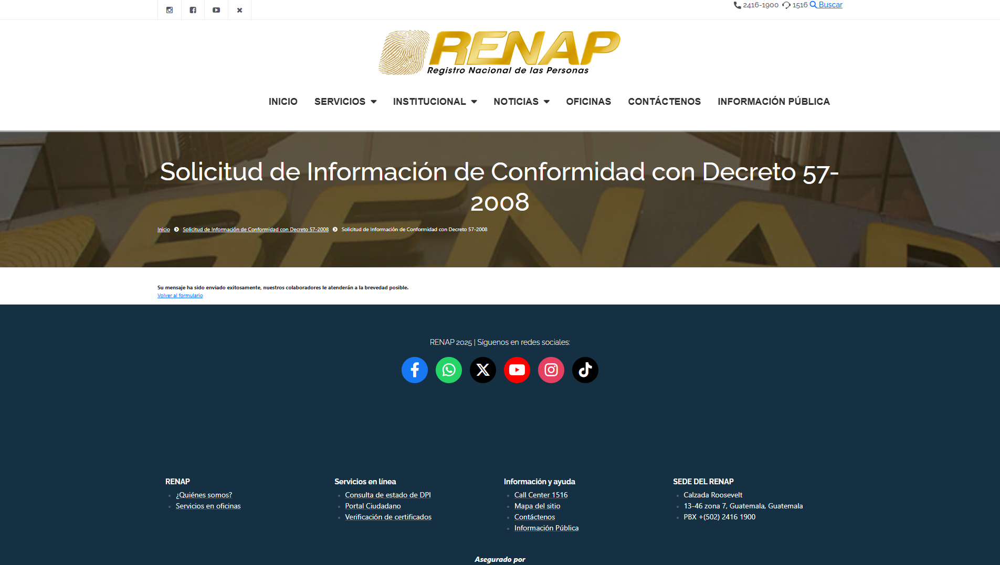

# RENAP — Solicitud Formal de Información

Como parte de la trazabilidad del dato y las buenas prácticas de gobernanza, el equipo redactó y gestionó una solicitud formal de acceso a información pública ante el **Registro Nacional de las Personas (RENAP)**, con base en el **Decreto 57-2008 — Ley de Acceso a la Información Pública** de Guatemala.

El objetivo de esta solicitud es obtener registros de defunción oficiales directamente desde la fuente primaria de registro civil del Estado, lo que permitiría contrastar y complementar los datos del INE con información de primera mano.

---

## Solicitud Enviada

La solicitud fue ingresada a través del portal oficial de Información Pública del RENAP:

**Portal:** [renap.gob.gt — Solicitud de Información Pública (Decreto 57-2008)](https://www.renap.gob.gt/solicitud-de-informacion-publica-decreto-57-2008)

---

## Confirmación de Recepción

El sistema del portal emitió una confirmación de recepción de la solicitud, acreditando que la petición fue registrada formalmente en el sistema de RENAP.

---

## Estado Actual — Sin Respuesta Formal

!!! warning "Solicitud pendiente de respuesta"
    A la fecha de entrega de este documento (**2026-06-14**), el RENAP **no ha brindado respuesta formal por ningún medio** — ni por correo electrónico, ni por el portal, ni por vía física.

El propio portal oficial de RENAP indica que el plazo de respuesta según Artículo 42 de la Ley de Acceso a la Información Pública puede extenderse hasta **10 días hábiles con la capacidad de ampliarese según Artículo 43 del mismo cuerpo legal otros 10 días hábiles** contados a partir de la recepción de la solicitud, conforme a lo establecido en el Decreto 57-2008.

---

## Declaración Formal del Equipo

>Por este medio, estudiantes de la Escuela de Ciencias y Sistemas de la Facultad de Ingeniería de la **Universidad de San Carlos de Guatemala (USAC)**, en el marco del curso Seminario de Sistemas 2 — Laboratorio de Ingeniería de Datos (Escuela de Vacaciones 2026, Sección A, a cargo del Ing. Marlon Orellana), nos dirigimos respetuosamente a ustedes con el propósito de formular una solicitud formal de acceso a información pública, de conformidad con lo establecido en la Ley de Acceso a la Información Pública (Decreto 57-2008 del Congreso de la República de Guatemala).
>
>El equipo estudiantil se encuentra desarrollando un proyecto académico denominado "Plataforma Analítica de Mortalidad End-to-End", cuyo objetivo es construir una prueba de concepto de una plataforma de datos integrada para el análisis comparativo de patrones de mortalidad en Guatemala durante los períodos **pre-COVID (2015–2019) y post-COVID (2020 en adelante)**, con fines estrictamente académicos y sin ningún propósito comercial. El proyecto se enmarca en una iniciativa de aprendizaje simulando una consultoría para el Programa de las Naciones Unidas para el Desarrollo (PNUD) y el Ministerio de Salud Pública y Asistencia Social (MSPAS).
>
> La solicitud fue presentada correctamente y se cuenta con la confirmación de recepción emitida por el sistema institucional del RENAP. Sin embargo, al momento de cierre de la Fase 1 del proyecto, la institución no ha emitido ninguna respuesta formal dentro ni fuera del plazo establecido por la normativa vigente.
>
> En consecuencia, el equipo procedió a utilizar como fuente primaria los datos de **Estadísticas Vitales de Defunciones publicados por el INE Guatemala**, que constituyen la fuente pública oficial disponible más completa para el análisis de mortalidad en el país.
>
> Esta solicitud y su evidencia quedan documentadas como parte del linaje y la trazabilidad del proceso de investigación, demostrando la diligencia debida del equipo en la búsqueda de datos de primera fuente.

---

## Trazabilidad del Trámite

| Elemento | Detalle |
|---|---|
| **Institución** | Registro Nacional de las Personas — RENAP |
| **Marco legal** | Decreto 57-2008, Ley de Acceso a la Información Pública |
| **Portal utilizado** | `renap.gob.gt/solicitud-de-informacion-publica-decreto-57-2008` |
| **Estado** | Confirmación de recepción obtenida — respuesta pendiente |
| **Plazo legal de respuesta** | Hasta 20 días hábiles según el portal RENAP |
| **Respuesta recibida** | Ninguna (a la fecha 2026-06-14) |
| **Acción tomada** | Se utilizó INE Guatemala como fuente primaria oficial alternativa |
| **Evidencia** | Captura de solicitud y confirmación archivadas en `docs/images/` |
