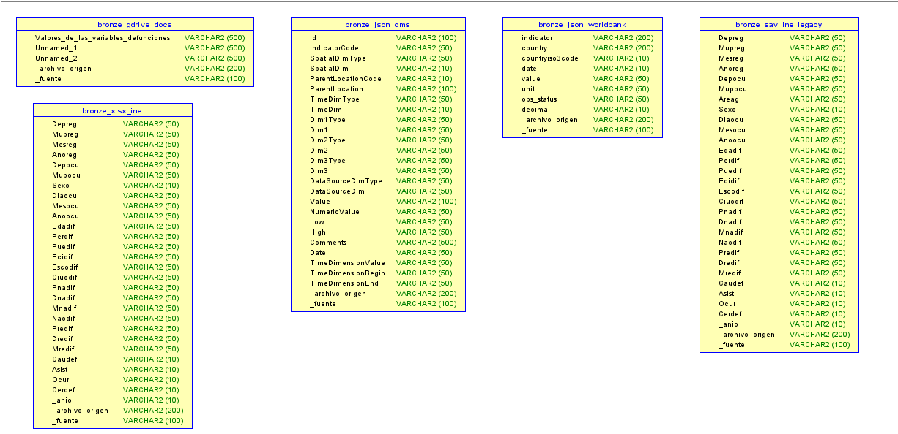

# Diccionario de Tablas — Capa Bronze (Sandbox)

Las cinco tablas Delta del schema `bronze` en Databricks Free Edition. Todas las tablas son independientes entre sí por diseño: una tabla por fuente de datos, sin relaciones entre ellas. Cada tabla incluye columnas de metadato de trazabilidad prefijadas con guion bajo.

**Leyenda de banderas:**

| Bandera | Significado |
|---|---|
| `[META]` | Metadato de trazabilidad inyectado durante la ingesta, no proviene de la fuente |
| `[SENSIBLE]` | Contiene o permite inferir información personal |
| `[CRITICA]` | Esencial para los análisis principales pre/post COVID |
| `NULL` | El campo puede estar vacío (diseño sin transformación destructiva) |

---

## `bronze.xlsx_ine`

**674,064 registros** · Fuente: INE Guatemala 2018–2024 · Formato original: XLSX

Microdatos de defunciones del Instituto Nacional de Estadística para el periodo post-2017. Cada fila representa un fallecimiento individual con sus atributos demográficos, geográficos y la causa de muerte codificada en CIE-10. Todos los campos se ingieren como string sin transformación.

| Columna | Tipo | Descripción | Dominio | Banderas |
|---|---|---|---|---|
| `Depreg` | string | Departamento de registro legal | Código numérico 1–22 | NULL |
| `Mupreg` | string | Municipio de registro legal | Código INE | NULL |
| `Mesreg` | string | Mes del registro legal | 1–12 | NULL |
| `Añoreg` | string | Año del registro legal | 2018–2024 | NULL |
| `Depocu` | string | Departamento donde ocurrió la muerte | Código numérico 1–22 | `[CRITICA]` NULL |
| `Mupocu` | string | Municipio donde ocurrió la muerte | Código INE | `[CRITICA]` `[SENSIBLE]` NULL |
| `Sexo` | string | Sexo biológico registrado | 1=Hombre, 2=Mujer, 9=Ignorado | `[CRITICA]` NULL |
| `Diaocu` | string | Día del fallecimiento | 1–31 | `[SENSIBLE]` NULL |
| `Mesocu` | string | Mes del fallecimiento | 1–12 | NULL |
| `Añoocu` | string | Año del fallecimiento | 2018–2024 | `[CRITICA]` NULL |
| `Edadif` | string | Edad en años al momento del fallecimiento | 0–120 | `[CRITICA]` `[SENSIBLE]` NULL |
| `Perdif` | string | Pertenencia étnica | 1=Maya, 2=Garífuna, 3=Xinca, 4=Mestizo, 5=Otro | `[SENSIBLE]` NULL |
| `Puedif` | string | Pueblo de pertenencia específico | Catálogo INE ~30 pueblos | `[SENSIBLE]` NULL |
| `Ecidif` | string | Estado civil al momento de la defunción | 1=Soltero, 2=Casado, 3=Unido, 4=Viudo, 5=Divorciado | NULL |
| `Escodif` | string | Último nivel educativo alcanzado | 0=Ninguno … 5=Superior, 9=Ignorado | NULL |
| `Ciuodif` | string | Código de ocupación | Clasificación CIUO del INE | `[SENSIBLE]` NULL |
| `Pnadif` | string | País de nacimiento | Códigos INE | NULL |
| `Dnadif` | string | Departamento de nacimiento | 1–22 | NULL |
| `Mnadif` | string | Municipio de nacimiento | Código INE | `[SENSIBLE]` NULL |
| `Nacdif` | string | Nacionalidad legal registrada | Códigos INE | NULL |
| `Predif` | string | País de residencia habitual | Códigos país | NULL |
| `Dredif` | string | Departamento de residencia habitual | 1–22 | `[SENSIBLE]` NULL |
| `Mredif` | string | Municipio de residencia habitual | Código INE | `[SENSIBLE]` NULL |
| `Caudef` | string | Causa de muerte en CIE-10 | A00–Z99 | `[CRITICA]` NULL |
| `Asist` | string | Tipo de asistencia médica recibida | 1=Con asistencia, 2=Sin, 3=En tránsito, 9=Ignorado | NULL |
| `Ocur` | string | Tipo de lugar donde ocurrió la muerte | 1=Hospital público, 2=IGSS, 3=Clínica privada, 4=Domicilio, 5=Vía pública | NULL |
| `Cerdef` | string | Quién certificó la defunción | 1=Médico tratante, 2=Forense, 3=Autoridad local | NULL |
| `_anio` | string | Año del archivo de origen | 2018–2024 | `[META]` |
| `_archivo_origen` | string | Ruta S3 del archivo que originó esta fila | raw/ine/defunciones_YYYY.xlsx | `[META]` |
| `_fuente` | string | Identificador de la fuente de datos | INE_GUATEMALA | `[META]` |

---

## `bronze.sav_ine_legacy`

**245,167 registros** · Fuente: INE Guatemala 2015–2017 · Formato original: SAV (SPSS), convertido a Parquet

Microdatos de defunciones para el periodo pre-2018. Estructura idéntica a `bronze.xlsx_ine` con la adición de la columna `Areag` presente únicamente en los archivos legacy. Los archivos originales .sav se preservan en S3 junto al parquet convertido.

| Columna | Tipo | Descripción | Dominio | Banderas |
|---|---|---|---|---|
| `Depreg` | string | Departamento de registro legal | Código numérico 1–22 | NULL |
| `Mupreg` | string | Municipio de registro legal | Código INE | NULL |
| `Mesreg` | string | Mes del registro legal | 1–12 | NULL |
| `Añoreg` | string | Año del registro legal | 2015–2017 | NULL |
| `Depocu` | string | Departamento donde ocurrió la muerte | Código numérico 1–22 | `[CRITICA]` NULL |
| `Mupocu` | string | Municipio donde ocurrió la muerte | Código INE | `[CRITICA]` `[SENSIBLE]` NULL |
| `Areag` | string | Clasificación urbana/rural del lugar de ocurrencia | 1=Urbano, 2=Rural | NULL |
| `Sexo` | string | Sexo biológico registrado | 1=Hombre, 2=Mujer, 9=Ignorado | `[CRITICA]` NULL |
| `Diaocu` | string | Día del fallecimiento | 1–31 | `[SENSIBLE]` NULL |
| `Mesocu` | string | Mes del fallecimiento | 1–12 | NULL |
| `Añoocu` | string | Año del fallecimiento | 2015–2017 | `[CRITICA]` NULL |
| `Edadif` | string | Edad en años al momento del fallecimiento | 0–120 | `[CRITICA]` `[SENSIBLE]` NULL |
| `Perdif` | string | Pertenencia étnica | 1=Maya, 2=Garífuna, 3=Xinca, 4=Mestizo, 5=Otro | `[SENSIBLE]` NULL |
| `Puedif` | string | Pueblo de pertenencia específico | Catálogo INE ~30 pueblos | `[SENSIBLE]` NULL |
| `Ecidif` | string | Estado civil | 1=Soltero, 2=Casado, 3=Unido, 4=Viudo, 5=Divorciado | NULL |
| `Escodif` | string | Último nivel educativo alcanzado | 0=Ninguno … 5=Superior, 9=Ignorado | NULL |
| `Ciuodif` | string | Código de ocupación | Clasificación CIUO del INE | `[SENSIBLE]` NULL |
| `Pnadif` | string | País de nacimiento | Códigos INE | NULL |
| `Dnadif` | string | Departamento de nacimiento | 1–22 | NULL |
| `Mnadif` | string | Municipio de nacimiento | Código INE | `[SENSIBLE]` NULL |
| `Nacdif` | string | Nacionalidad legal registrada | Códigos INE | NULL |
| `Predif` | string | País de residencia habitual | Códigos país | NULL |
| `Dredif` | string | Departamento de residencia habitual | 1–22 | `[SENSIBLE]` NULL |
| `Mredif` | string | Municipio de residencia habitual | Código INE | `[SENSIBLE]` NULL |
| `Caudef` | string | Causa de muerte en CIE-10 | A00–Z99 | `[CRITICA]` NULL |
| `Asist` | string | Tipo de asistencia médica recibida | 1=Con asistencia, 2=Sin, 3=En tránsito, 9=Ignorado | NULL |
| `Ocur` | string | Tipo de lugar donde ocurrió la muerte | 1=Hospital público, 2=IGSS, 3=Clínica privada, 4=Domicilio, 5=Vía pública | NULL |
| `Cerdef` | string | Quién certificó la defunción | 1=Médico tratante, 2=Forense, 3=Autoridad local | NULL |
| `_anio` | string | Año del archivo de origen | 2015–2017 | `[META]` |
| `_archivo_origen` | string | Ruta S3 del archivo que originó esta fila | raw/ine/defunciones_YYYY.parquet | `[META]` |
| `_fuente` | string | Identificador de la fuente de datos | INE_GUATEMALA_LEGACY | `[META]` |

---

## `bronze.json_oms`

**1,708 registros** · Fuente: WHO/OMS Global Health Observatory API · Granularidad: País × Indicador × Año × Sexo

Indicadores oficiales de salud agregados a nivel país descargados desde la API pública GHO. No contiene datos individuales. Cubre Guatemala, Costa Rica, Honduras, El Salvador y Panamá.

| Columna | Tipo | Descripción | Dominio | Banderas |
|---|---|---|---|---|
| `Id` | string | ID interno del registro en la base de datos GHO | Entero como string | NULL |
| `IndicatorCode` | string | Código GHO del indicador | WHOSIS_000001, WHOSIS_000002, MDG_0000000001 | `[CRITICA]` |
| `SpatialDimType` | string | Tipo de dimensión espacial | COUNTRY | NULL |
| `SpatialDim` | string | Código ISO-3 del país | GTM, CRI, HND, SLV, PAN | `[CRITICA]` |
| `ParentLocationCode` | string | Código de región OMS | AMR | NULL |
| `ParentLocation` | string | Nombre de la región OMS | Americas | NULL |
| `TimeDimType` | string | Tipo de dimensión temporal | YEAR | NULL |
| `TimeDim` | string | Año de medición | 1990–2023 aprox. | `[CRITICA]` |
| `Dim1Type` | string | Tipo de primera dimensión adicional | SEX | NULL |
| `Dim1` | string | Valor de la primera dimensión | Male, Female, Both sexes | NULL |
| `Dim2Type` | string | Tipo de segunda dimensión | Vacío en estos indicadores | NULL |
| `Dim2` | string | Valor de la segunda dimensión | NULL | NULL |
| `Dim3Type` | string | Tipo de tercera dimensión | NULL | NULL |
| `Dim3` | string | Valor de la tercera dimensión | NULL | NULL |
| `DataSourceDimType` | string | Tipo de fuente de datos | NULL | NULL |
| `DataSourceDim` | string | Fuente de datos específica | NULL | NULL |
| `Value` | string | Valor del indicador como texto | Cadena | NULL |
| `NumericValue` | string | Valor numérico del indicador | Real positivo | `[CRITICA]` NULL |
| `Low` | string | Límite inferior del intervalo de confianza | Real positivo | NULL |
| `High` | string | Límite superior del intervalo de confianza | Real positivo | NULL |
| `Comments` | string | Notas metodológicas de la OMS | Texto libre | NULL |
| `Date` | string | Fecha de publicación del dato | ISO 8601 | NULL |
| `TimeDimensionValue` | string | Valor canónico de la dimensión temporal | Año como string | NULL |
| `TimeDimensionBegin` | string | Inicio del periodo de medición | ISO 8601 | NULL |
| `TimeDimensionEnd` | string | Fin del periodo de medición | ISO 8601 | NULL |
| `_archivo_origen` | string | Ruta S3 del JSON que originó esta fila | raw/oms/who_{indicador}_{pais}.json | `[META]` |
| `_fuente` | string | Identificador de la fuente | WHO_OMS | `[META]` |

---

## `bronze.json_worldbank`

**450 registros** · Fuente: World Bank API · Granularidad: País × Indicador × Año

Cinco indicadores de mortalidad y causa de muerte para seis países centroamericanos (GTM, CRI, HND, SLV, PAN, NIC) con rango temporal 2010–2024. Esta fuente reemplazó a CEPAL CEPALSTAT cuyo dominio no fue resolvible durante la ingesta, fallo documentado en la tabla de auditoría (run_id 22).

| Columna | Tipo | Descripción | Dominio | Banderas |
|---|---|---|---|---|
| `indicator` | string | Objeto JSON con id y valor del indicador | Serializado como string | `[CRITICA]` |
| `country` | string | Objeto JSON con id y nombre del país | Serializado como string | `[CRITICA]` |
| `countryiso3code` | string | Código ISO-3 del país | GTM, CRI, HND, SLV, PAN, NIC | `[CRITICA]` |
| `date` | string | Año de la medición | 2010–2024 | `[CRITICA]` |
| `value` | string | Valor numérico del indicador | Real, puede ser NULL | `[CRITICA]` NULL |
| `unit` | string | Unidad de medida | Vacío en estos indicadores | NULL |
| `obs_status` | string | Estado de la observación | Vacío=real, E=estimado, P=preliminar | NULL |
| `decimal` | string | Decimales de precisión del valor | Entero como string | NULL |
| `_archivo_origen` | string | Ruta S3 del JSON que originó esta fila | raw/centroamerica/worldbank_{indicador}.json | `[META]` |
| `_fuente` | string | Identificador de la fuente | WORLDBANK | `[META]` |

---

## `bronze.gdrive_docs`

**1,837 registros** · Fuente: Google Drive del equipo · Formato original: XLSX

Diccionario de variables del INE descargado desde una carpeta compartida de Google Drive. Contiene los códigos y etiquetas necesarios para decodificar los valores numéricos de las tablas `bronze.xlsx_ine` y `bronze.sav_ine_legacy`. Las columnas tienen nombres generados automáticamente al limpiar caracteres especiales del Excel original.

| Columna | Tipo | Descripción | Dominio | Banderas |
|---|---|---|---|---|
| `Valores_de_las_variables_defunciones` | string | Nombre de la variable o categoría del diccionario | Texto libre | `[CRITICA]` NULL |
| `Unnamed:_1` | string | Segunda columna del Excel original sin encabezado | Texto libre | NULL |
| `Unnamed:_2` | string | Tercera columna del Excel original sin encabezado | Texto libre | NULL |
| `_archivo_origen` | string | Ruta S3 del Excel que originó esta fila | raw/gdrive/diccionario_defunciones_ine.xlsx | `[META]` |
| `_fuente` | string | Identificador de la fuente | GOOGLE_DRIVE | `[META]` |

---

## ERD — Tablas Bronze (Fase 1)

Las cinco tablas del schema `bronze` en Databricks no tienen relaciones entre ellas por diseño. El ERD muestra su estructura física tal como fue importada desde el DDL generado a partir de los schemas reales de Databricks.

---

## ERD — Base de Datos de Auditoría

El schema `semi2` en PostgreSQL 16 (Docker, localhost:5432, base `law`) registra cada operación de ingesta. La tabla `scraping_runs` registra cada ejecución con run_id, fuente, URL de origen, estado, bytes y checksum. La tabla `archivos_descargados` registra cada archivo individual con su checksum MD5 y ruta S3. La vista `resumen_ingesta` agrega por fuente para monitoreo rápido.

