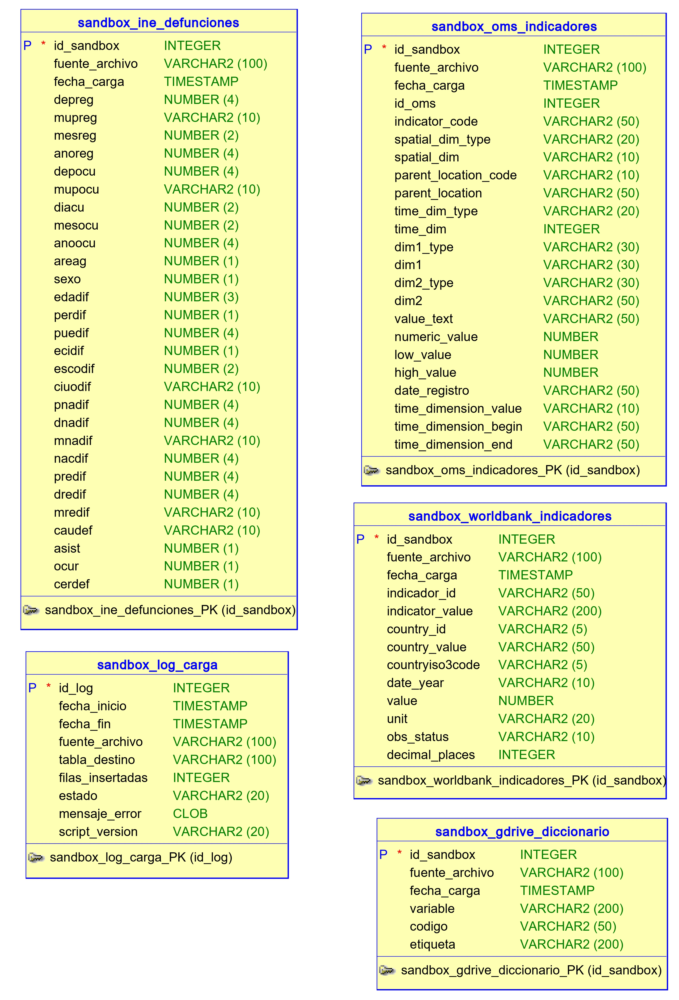
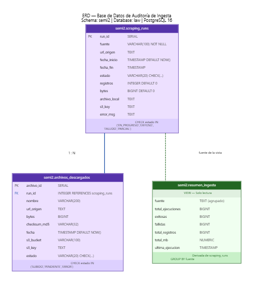

# Diccionario de Tablas — Capa Sandbox

Las cinco tablas físicas del esquema `sandbox` en PostgreSQL. Todas comparten tres columnas de linaje (`id_sandbox`, `fuente_archivo`, `fecha_carga`) inyectadas automáticamente durante la ingesta.

**Leyenda de banderas:**

| Bandera | Significado |
|---|---|
| `PK` | Llave primaria |
| `[LINAJE]` | Metadato de trazabilidad, no es dato de dominio |
| `[SENSIBLE]` | Contiene o permite inferir información personal |
| `[CRITICA]` | Esencial para los análisis principales |
| `NULL` | El campo puede estar vacío (diseño "Cero Destrucción") |

---

## `sandbox_ine_defunciones`

**921,208 registros** · Fuente: INE Guatemala 2015–2024

Tabla transaccional principal. Cada fila representa un fallecimiento individual con sus atributos demográficos, geográficos y la causa de muerte codificada en CIE-10.

| Columna | Tipo | Etiqueta | Descripción | Dominio | Banderas |
|---|---|---|---|---|---|
| `id_sandbox` | SERIAL | ID de Ingesta | Identificador único de ingesta, no proviene del INE | Autoincremental | `PK` `[LINAJE]` |
| `fuente_archivo` | VARCHAR(100) | Archivo Origen | Ruta S3 del archivo que originó esta fila | `raw/ine/defunciones_YYYY.xlsx` | `[LINAJE]` |
| `fecha_carga` | TIMESTAMP | Fecha de Carga | Marca de tiempo UTC de inserción | UTC | `[LINAJE]` |
| `depreg` | NUMERIC(4,0) | Depto. Registro | Departamento de registro legal | 1–22 | NULL |
| `mupreg` | VARCHAR(10) | Mpio. Registro | Municipio de registro legal | Código INE | NULL `[SENSIBLE]` |
| `mesreg` | NUMERIC(2,0) | Mes Registro | Mes del registro legal | 1–12 | NULL |
| `anoreg` | NUMERIC(4,0) | Año Registro | Año del registro legal | 2015–2024 | NULL |
| `depocu` | NUMERIC(4,0) | Depto. Ocurrencia | Departamento donde ocurrió la muerte — **variable geográfica principal** | 1–22 | `[CRITICA]` NULL |
| `mupocu` | VARCHAR(10) | Mpio. Ocurrencia | Municipio donde ocurrió la muerte — granularidad máxima | Código INE | `[CRITICA]` `[SENSIBLE]` NULL |
| `diaocu` | NUMERIC(2,0) | Día Ocurrencia | Día del fallecimiento | 1–31 | `[SENSIBLE]` NULL |
| `mesocu` | NUMERIC(2,0) | Mes Ocurrencia | Mes del fallecimiento | 1–12 | NULL |
| `anoocu` | NUMERIC(4,0) | Año Ocurrencia | Año del fallecimiento — **variable temporal principal** | 2015–2024 | `[CRITICA]` NULL |
| `areag` | NUMERIC(1,0) | Área Geográfica | Clasificación urbana/rural del lugar de ocurrencia | 1=Urbano, 2=Rural | NULL |
| `sexo` | NUMERIC(1,0) | Sexo | Sexo biológico registrado | 1=Hombre, 2=Mujer, 9=Ignorado | `[CRITICA]` NULL |
| `edadif` | NUMERIC(3,0) | Edad | Edad en años al momento del fallecimiento | 0–120 | `[CRITICA]` `[SENSIBLE]` NULL |
| `perdif` | NUMERIC(1,0) | Pertenencia Étnica | Grupo étnico autodeclarado o registrado | 1=Maya, 2=Garífuna, 3=Xinca, 4=Mestizo, 5=Otro | `[SENSIBLE]` NULL |
| `puedif` | NUMERIC(4,0) | Pueblo de Pertenencia | Pueblo específico (ej. K'iche', Mam) | Catálogo INE ~30 pueblos | `[SENSIBLE]` NULL |
| `ecidif` | NUMERIC(1,0) | Estado Civil | Estado civil al momento de la defunción | 1=Soltero, 2=Casado, 3=Unido, 4=Viudo, 5=Divorciado | NULL |
| `escodif` | NUMERIC(2,0) | Escolaridad | Último nivel educativo alcanzado | 0=Ninguno … 5=Superior, 9=Ignorado | NULL |
| `ciuodif` | VARCHAR(10) | Ocupación | Código de ocupación/profesión — alta tasa de nulos | Clasificación CIUO del INE | `[SENSIBLE]` NULL |
| `pnadif` | NUMERIC(4,0) | País Nacimiento | País de nacimiento | Códigos INE | NULL |
| `dnadif` | NUMERIC(4,0) | Depto. Nacimiento | Departamento de nacimiento (si Guatemala) | 1–22 | NULL |
| `mnadif` | VARCHAR(10) | Mpio. Nacimiento | Municipio de nacimiento | Código INE | `[SENSIBLE]` NULL |
| `nacdif` | NUMERIC(4,0) | Nacionalidad | Nacionalidad legal registrada | Códigos INE | NULL |
| `predif` | NUMERIC(4,0) | País Residencia | País de residencia habitual | Códigos país | NULL |
| `dredif` | NUMERIC(4,0) | Depto. Residencia | Departamento de residencia habitual | 1–22 | `[SENSIBLE]` NULL |
| `mredif` | VARCHAR(10) | Mpio. Residencia | Municipio de residencia habitual | Código INE | `[SENSIBLE]` NULL |
| `caudef` | VARCHAR(10) | Causa CIE-10 | **Causa de muerte en CIE-10.** Ej: I219=Infarto, J18=Neumonía, X95=Agresión por arma | A00–Z99 | `[CRITICA]` NULL |
| `asist` | NUMERIC(1,0) | Asistencia Médica | Tipo de asistencia recibida | 1=Con asistencia, 2=Sin, 3=En tránsito, 9=Ignorado | NULL |
| `ocur` | NUMERIC(1,0) | Lugar Ocurrencia | Tipo de lugar donde ocurrió la muerte | 1=Hospital público, 2=IGSS, 3=Clínica privada, 4=Domicilio, 5=Vía pública | NULL |
| `cerdef` | NUMERIC(1,0) | Certificador | Quién certificó oficialmente la defunción | 1=Médico tratante, 2=Forense, 3=Autoridad local | NULL |

---

## `sandbox_oms_indicadores`

**1,708 registros** · Fuente: WHO/OMS GHO API · Granularidad: País × Indicador × Año × Sexo

Estadística agregada oficial de salud a nivel país. No contiene datos individuales.

| Columna | Tipo | Etiqueta | Descripción | Dominio | Banderas |
|---|---|---|---|---|---|
| `id_sandbox` | SERIAL | ID Ingesta | Identificador único | Autoincremental | `PK` `[LINAJE]` |
| `fuente_archivo` | VARCHAR(100) | Archivo Origen | Nombre del JSON en S3 | `who_{indicador}_{país}.json` | `[LINAJE]` |
| `fecha_carga` | TIMESTAMP | Fecha Carga | Momento de inserción UTC | UTC | `[LINAJE]` |
| `id_oms` | BIGINT | ID OMS | ID interno del registro en la BD de la OMS | Entero | NULL |
| `indicator_code` | VARCHAR(50) | Código Indicador | Código GHO del indicador (ej. `WHOSIS_000001`) | Catálogo GHO | `[CRITICA]` |
| `spatial_dim` | VARCHAR(10) | País ISO-3 | Código ISO 3166-1 alpha-3 — **llave de cruce con Banco Mundial** | GTM, CRI, HND, SLV, PAN | `[CRITICA]` |
| `parent_location_code` | VARCHAR(10) | Región OMS | Código de región OMS | AMR (Américas) | NULL |
| `time_dim` | INTEGER | Año | Año de medición — **llave temporal** | 1990–2023 aprox. | `[CRITICA]` |
| `dim1` | VARCHAR(30) | Sexo | Desagregación por sexo | Male, Female, Both sexes | NULL |
| `numeric_value` | NUMERIC | **Valor** | Valor numérico del indicador — **columna de análisis principal** | Real positivo | `[CRITICA]` NULL |
| `low_value` | NUMERIC | IC Inferior | Límite inferior del intervalo de confianza | Real positivo | NULL |
| `high_value` | NUMERIC | IC Superior | Límite superior del intervalo de confianza | Real positivo | NULL |

---

## `sandbox_worldbank_indicadores`

**450 registros** · Fuente: World Bank API · Granularidad: País × Indicador × Año

Indicadores macroeconómicos y de salud agregados a nivel país para 6 países centroamericanos.

| Columna | Tipo | Etiqueta | Descripción | Dominio | Banderas |
|---|---|---|---|---|---|
| `id_sandbox` | SERIAL | ID Ingesta | Identificador único | Autoincremental | `PK` `[LINAJE]` |
| `fuente_archivo` | VARCHAR(100) | Archivo Origen | Ruta del JSON en S3 | Cadena | `[LINAJE]` |
| `fecha_carga` | TIMESTAMP | Fecha Carga | Momento de inserción UTC | UTC | `[LINAJE]` |
| `indicator_id` | VARCHAR(50) | Código Indicador BM | Código técnico del Banco Mundial (ej. `SP.DYN.CDRT.IN`) | Catálogo BM | `[CRITICA]` |
| `indicator_value` | VARCHAR(200) | Nombre Indicador | Nombre completo en inglés | Texto | NULL |
| `countryiso3code` | VARCHAR(5) | País ISO-3 | Código estándar — **llave de cruce con OMS** | GTM, CRI, HND, SLV, PAN, NIC | `[CRITICA]` |
| `date_year` | VARCHAR(10) | Año | Año de la medición | 2010–2024 | `[CRITICA]` |
| `value` | NUMERIC | **Valor** | Valor numérico del indicador — **columna de análisis principal** | Real, puede ser NULL | `[CRITICA]` NULL |
| `obs_status` | VARCHAR(10) | Estado Observación | Indica si es dato real, estimado o preliminar | Vacío=real, E=estimado, P=preliminar | NULL |

---

## `sandbox_gdrive_diccionario`

**1,837 registros** · Fuente: Diccionario del equipo (Google Drive)

Catálogo maestro para decodificar los códigos numéricos del INE. Sin esta tabla, los datos de `sandbox_ine_defunciones` son ilegibles.

| Columna | Tipo | Etiqueta | Descripción | Dominio | Banderas |
|---|---|---|---|---|---|
| `id_sandbox` | SERIAL | ID Ingesta | Identificador único | Autoincremental | `PK` `[LINAJE]` |
| `fuente_archivo` | VARCHAR(100) | Archivo Origen | Ruta del Excel en S3 | `raw/gdrive/diccionario_defunciones_ine.xlsx` | `[LINAJE]` |
| `fecha_carga` | TIMESTAMP | Fecha Carga | Momento de inserción UTC | UTC | `[LINAJE]` |
| `variable` | VARCHAR(200) | Variable | Nombre exacto de la columna en `sandbox_ine_defunciones` | Ej: `depocu`, `sexo` | `[CRITICA]` |
| `codigo` | VARCHAR(50) | Código | Valor crudo tal como aparece en el INE (VARCHAR para soportar CIE-10) | Ej: `1`, `I219` | `[CRITICA]` |
| `etiqueta` | VARCHAR(200) | Etiqueta | Significado legible del código | Ej: `Guatemala`, `Hombre` | `[CRITICA]` |

---

## ERD — Fuentes de Datos (Fase 1)

Diagrama entidad-relación de las cinco tablas físicas del schema `sandbox` en PostgreSQL, mostrando las relaciones entre los datos del INE, la OMS, el Banco Mundial y el diccionario de variables.

---

## ERD — Base de Datos de Auditoría

El schema `semi2` en PostgreSQL registra cada operación de ingesta en dos tablas relacionadas (`scraping_runs` y `archivos_descargados`) y expone una vista de resumen agregada por fuente (`resumen_ingesta`).

---

## `sandbox_log_carga`

**Variable** · Generada automáticamente por el pipeline

Tabla de auditoría operativa. Registra cada evento de ingesta con su resultado.

| Columna | Tipo | Etiqueta | Descripción | Dominio | Banderas |
|---|---|---|---|---|---|
| `id_log` | SERIAL | ID Evento | Identificador del evento de carga | Autoincremental | `PK` |
| `fecha_inicio` | TIMESTAMP | Inicio | Hora de inicio de la ingesta | UTC | |
| `fecha_fin` | TIMESTAMP | Fin | Hora de fin del bloque de carga | UTC | NULL |
| `fuente_archivo` | VARCHAR(100) | Archivo | Ruta S3 del archivo procesado | Cadena | |
| `tabla_destino` | VARCHAR(100) | Tabla Destino | Tabla Sandbox receptora | `sandbox_ine_defunciones`, etc. | |
| `filas_insertadas` | INTEGER | Filas | Conteo exacto de registros insertados | Entero positivo | NULL |
| `estado` | VARCHAR(20) | Estado | Resultado de la operación | `EXITO`, `ERROR`, `OMITIDO` | |
| `mensaje_error` | TEXT | Error | Traza técnica si el estado es `ERROR` | Texto o NULL | NULL |
| `script_version` | VARCHAR(20) | Versión Script | Versión del script Python que realizó la carga | Semver (ej: `1.2.0`) | NULL |
