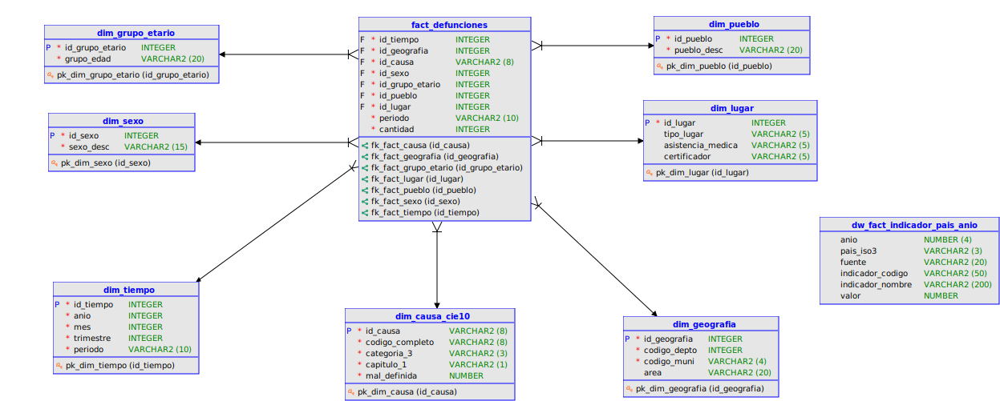

# Modelo Dimensional — Data Warehouse Estrella

## Introducción

El Data Warehouse implementa un esquema estrella (Kimball) optimizado para análisis multidimensional de mortalidad. El modelo transforma la tabla conformada `stage.defunciones` (919,231 registros) en una estructura dimensional que soporta consultas pre/post-COVID eficientemente.

**Arquitectura:**
- 1 tabla de hechos: `fact_defunciones`
- 7 tablas de dimensión: tiempo, geografía, causa, sexo, grupo etario, pueblo, lugar
- Grano: una defunción
- Medida principal: cantidad (=1, en escala atómica)

### Diagrama Entidad-Relación: Modelo Estrella



---

## 1. Decisiones de diseño

### 1.1 Grano del hecho

**Nivel de granularidad:** Una fila = una defunción individual

**Justificación:**
- Preserva máxima flexibilidad analítica (agregación desde el átomo)
- Permite medidas aditivas: suma de cantidad = total de defunciones
- Habilita jerarquías en dimensiones (por ej: mes → trimestre → año)

**Alternativa rechazada:**
Hecho preaagregado por departamento/mes sería más compacto pero eliminaría capacidad de análisis ad-hoc (ej: por municipio, por etnia, etc.).

---

### 1.2 Medida principal

**Medida:** `cantidad` (siempre = 1)

**Valores aditivos:** SUM por cualquier combinación de dimensiones

**Ventajas:**
- Simple: evita errores de conversión de unidades
- Coherente con OLAP (cúbos de análisis)
- Reproducible: cantidad = COUNT(*)

---

### 1.3 Identificadores de llave

**Estrategia:** Llaves naturales derivadas del negocio, no artificiales

- `id_tiempo`: AAAAMM (concatenación de año-mes)
- `id_geografia`: depto(2dígitos) + municipio(4dígitos) = 6 dígitos
- `id_causa`: código CIE-10 completo (ej: "U071", "R992")
- `id_sexo`: código INE (1, 2, 9)
- `id_grupo_etario`: código OPS (0–6, 9)
- `id_pueblo`: código INE (1–5, 9)
- `id_lugar`: concatenación de sitio + asistencia + certificador

**Ventaja:** Las llaves contienen significado (no son opacos números secuenciales), facilitando debugging y auditoría.

---

## 2. Tabla de hechos: fact_defunciones

### Estructura

```sql
CREATE TABLE fact_defunciones (
    id_tiempo        INT,           -- FK: AAAAMM
    id_geografia     INT,           -- FK: depto+muni
    id_causa         VARCHAR(8),    -- FK: CIE-10
    id_sexo          INT,           -- FK: 1,2,9
    id_grupo_etario  INT,           -- FK: 0..6,9
    id_pueblo        INT,           -- FK: 1..5,9
    id_lugar         INT,           -- FK: sitio+asist+cert
    periodo          VARCHAR(10),   -- Degenerate: PRE_COVID/POST_COVID
    cantidad         INT            -- Medida (=1)
);
```

### Campos

| Campo | Tipo | Rol | Descripción |
|---|---|---|---|
| `id_tiempo` | INT | FK | Concatenación AAAAMM para índices eficientes |
| `id_geografia` | INT | FK | Depto(2) + municipio(4), ej: 010101 (Guat., Guatemala) |
| `id_causa` | VARCHAR(8) | FK | Código CIE-10 sin punto; conserva jerarquía en dim |
| `id_sexo` | INT | FK | 1=Hombre, 2=Mujer, 9=Ignorado |
| `id_grupo_etario` | INT | FK | OPS: 0=<1año, 1=1-4años, ..., 6=≥65años, 9=Ign. |
| `id_pueblo` | INT | FK | 1=Indígena, 2=Ladino, 3=Xinca, 4=Garifuna, 5=Otro, 9=Ign. |
| `id_lugar` | INT | FK | Composite: sitio + asistencia + certificador |
| `periodo` | VARCHAR(10) | Degenerate | PRE_COVID (≤2019) o POST_COVID (≥2020) |
| `cantidad` | INT | Medida | Siempre 1 (entidades agregables) |

### Cardinalidad de fact

**Registros esperados:** 919,231 (equivalente a filas en `stage.defunciones`)

**Índices recomendados:**
- Clave primaria compuesta: (id_tiempo, id_geografia, id_causa, id_sexo, id_grupo_etario, id_pueblo, id_lugar)
- O: índice en (id_tiempo, id_causa) para análisis frecuentes

---

## 3. Dimensión: dim_tiempo

### Propósito

Responder preguntas temporales: ¿defunciones por mes? ¿comparar 2015 vs 2023? ¿tendencias por trimestre?

### Estructura

```sql
CREATE TABLE dim_tiempo (
    id_tiempo   INT,           -- PK: AAAAMM
    anio        INT,
    mes         INT,           -- 1..12
    trimestre   INT,           -- 1..4, derivado
    periodo     VARCHAR(10)    -- PRE_COVID o POST_COVID
);
```

### Ejemplos de datos

| id_tiempo | anio | mes | trimestre | periodo |
|---|---|---|---|---|
| 201501 | 2015 | 1 | 1 | PRE_COVID |
| 201512 | 2015 | 12 | 4 | PRE_COVID |
| 202001 | 2020 | 1 | 1 | POST_COVID |
| 202412 | 2024 | 12 | 4 | POST_COVID |

### Jerarquía temporal

```
Año → Trimestre → Mes → (Día disponible en fact con granularidad atómica)
```

### Cardinalidad

12 meses × 10 años = 120 registros (máximo)

---

## 4. Dimensión: dim_geografia

### Propósito

Análisis por ubicación geográfica: ¿defunciones por departamento? ¿municipio? ¿urbano vs rural?

### Estructura

```sql
CREATE TABLE dim_geografia (
    id_geografia  INT,         -- PK: depto(2) + muni(4)
    codigo_depto  INT,         -- 1..22
    codigo_muni   VARCHAR(4),  -- 0101..2201 (lpad)
    area          VARCHAR(20)  -- urbano/rural (solo 2015-2017)
);
```

### Ejemplos

| id_geografia | codigo_depto | codigo_muni | area |
|---|---|---|---|
| 10101 | 1 | 0101 | urbano |
| 10102 | 1 | 0102 | urbano |
| 101031 | 1 | 0103 | rural |
| 222201 | 22 | 2201 | NULL |

### Cardinalidad

~334 municipios × 2 clasificaciones área = ~668 registros

**Limitación:** `area` es NULL para 2018–2024 (disponible solo 2015–2017).

### Jerarquía geográfica

```
País (Guatemala) → Departamento → Municipio → [Área urbano/rural]
```

---

## 5. Dimensión: dim_causa_cie10

### Propósito

Análisis por causa de defunción: ¿mortalidad por capítulo CIE? ¿por categoría específica? ¿COVID-19 vs otras causas?

### Estructura

```sql
CREATE TABLE dim_causa_cie10 (
    id_causa        VARCHAR(8),  -- PK: código completo
    codigo_completo VARCHAR(8),  -- Redundante para claridad
    categoria_3     VARCHAR(3),  -- Categoría (3 chars)
    capitulo_1      VARCHAR(1),  -- Capítulo (1 char)
    mal_definida    BOOLEAN      -- Flag: capítulo R
);
```

### Ejemplos

| id_causa | codigo_completo | categoria_3 | capitulo_1 | mal_definida |
|---|---|---|---|---|
| U071 | U071 | U07 | U | FALSE |
| I219 | I219 | I21 | I | FALSE |
| R992 | R992 | R99 | R | TRUE |
| E149 | E149 | E14 | E | FALSE |

### Jerarquía CIE-10

```
Capítulo (1 char: A..Z) → Categoría (3 chars) → Código completo (4+ chars)
```

Ejemplo: Capítulo U (COVID-19) → U07 (COVID-19) → U071 (COVID-19, confirmado por laboratorio).

### Cardinalidad

~2,600 códigos únicos en período de estudio

### Caveat: Mal definida (Capítulo R)

Aproximadamente 13.5% de defunciones tienen causa mal definida (capítulo R: síntomas, signos, hallazgos anormales). El flag `mal_definida=TRUE` permite:
- Análisis de calidad de datos
- Filtrado opcional (causa raíz = excluir mal definidas)

---

## 6. Dimensión: dim_sexo

### Propósito

Análisis por género: ¿diferencias en mortalidad por sexo? ¿por causa y sexo?

### Estructura

```sql
CREATE TABLE dim_sexo (
    id_sexo    INT,          -- PK: 1, 2, 9
    sexo_desc  VARCHAR(15)   -- Descripción
);
```

### Datos

| id_sexo | sexo_desc |
|---|---|
| 1 | Hombre |
| 2 | Mujer |
| 9 | Ignorado |

### Cardinalidad

3 registros (categoría pequeña)

---

## 7. Dimensión: dim_grupo_etario

### Propósito

Análisis por edad: ¿mortalidad infantil? ¿personas adultas mayores? ¿pirámide etaria?

### Estructura

```sql
CREATE TABLE dim_grupo_etario (
    id_grupo_etario  INT,          -- PK: 0..6, 9
    grupo_edad       VARCHAR(20)   -- Descripción OPS
);
```

### Grupos etarios (estándar OPS)

| id | grupo_edad | Rango |
|---|---|---|
| 0 | Menor de 1 año | <1 |
| 1 | 1 a 4 años | 1-4 |
| 2 | 5 a 9 años | 5-9 |
| 3 | 10 a 19 años | 10-19 |
| 4 | 20 a 49 años | 20-49 |
| 5 | 50 a 64 años | 50-64 |
| 6 | 65 años y más | ≥65 |
| 9 | No especificado | Ignorado |

### Cardinalidad

8 registros

### Nota técnica

El grupo "Menor de 1 año" incluye:
- Registros con `Perdif=1` (edad en días)
- Registros con `Perdif=2` (edad en meses)
- Registros con `edad_anios=0`

Esta consolidación corrige el Hallazgo H4 del EDA (edades en unidades mixtas).

---

## 8. Dimensión: dim_pueblo

### Propósito

Análisis por pueblo/etnia: ¿mortalidad diferenciada por grupos étnicos? ¿disparidades étnicas en causas?

### Estructura

```sql
CREATE TABLE dim_pueblo (
    id_pueblo    INT,          -- PK: 1..5, 9
    pueblo_desc  VARCHAR(20)   -- Descripción
);
```

### Pueblos (clasificación INE Guatemala)

| id | pueblo_desc |
|---|---|
| 1 | Indígena |
| 2 | Ladino |
| 3 | Xinca |
| 4 | Garifuna |
| 5 | Otro |
| 9 | Ignorado |

### Cardinalidad

6 registros

### Caveat: Cobertura (Hallazgo H7)

- 16–19% de registros tienen pueblo=Ignorado (convertido a NULL en Stage)
- Análisis por pueblo con garantía de n ≥ 5 (para privacidad k-anonimato)
- Grupos minoritarios (Xinca, Garifuna) pueden tener baja representación

**Implicación ética:**
Disparidades en mortalidad observadas por pueblo pueden reflejar tanto realidad epidemiológica como sesgo en recolección de datos.

---

## 9. Dimensión: dim_lugar

### Propósito

Análisis por contexto de ocurrencia: ¿defunciones en hospital vs hogar? ¿con asistencia médica? ¿quién certificó?

### Estructura

```sql
CREATE TABLE dim_lugar (
    id_lugar           INT,          -- PK: composite
    tipo_lugar         VARCHAR(5),   -- Sitio de ocurrencia
    asistencia_medica  VARCHAR(5),   -- Recibió asistencia
    certificador       VARCHAR(5)    -- Quién certificó
);
```

### Componentes

**Sitio de ocurrencia (`Ocur`):**
- 1: Hospital / Clínica
- 2: Domicilio
- 3: Vía pública
- 4: Otro lugar
- 9: Ignorado

**Asistencia médica (`Asist`):**
- 1: Sí, médico
- 2: Sí, paramédico
- 3: No
- 9: Ignorado

**Certificador (`Cerdef`):**
- 1: Médico
- 2: Paramédico
- 3: Autoridad civil
- 9: Ignorado

### Ejemplo de id_lugar

ID construido como concatenación: `Ocur` (1 dígito) + `Asist` (1 dígito) + `Cerdef` (1 dígito)

Ej: 111 = Hospital + Asistencia médica + Médico certificador

### Cardinalidad

5 × 4 × 4 = 80 combinaciones posibles (muchas pueden estar vacías)

---

## 10. Análisis multidimensional: Ejemplos de consultas

### Ejemplo 1: Mortalidad por año pre/post-COVID

```sql
SELECT 
    t.anio,
    t.periodo,
    SUM(f.cantidad) AS total_defunciones
FROM fact_defunciones f
JOIN dim_tiempo t ON f.id_tiempo = t.id_tiempo
GROUP BY t.anio, t.periodo
ORDER BY t.anio;
```

### Ejemplo 2: Top 10 causas de muerte, comparativa pre/post

```sql
SELECT 
    c.codigo_completo,
    c.capitulo_1,
    t.periodo,
    SUM(f.cantidad) AS muertes
FROM fact_defunciones f
JOIN dim_causa_cie10 c ON f.id_causa = c.id_causa
JOIN dim_tiempo t ON f.id_tiempo = t.id_tiempo
WHERE c.mal_definida = FALSE  -- Excluir causas mal definidas
GROUP BY c.codigo_completo, c.capitulo_1, t.periodo
ORDER BY t.periodo, muertes DESC
LIMIT 10;
```

### Ejemplo 3: Mortalidad por pueblo, controlando por edad

```sql
SELECT 
    p.pueblo_desc,
    e.grupo_edad,
    SUM(f.cantidad) AS defunciones
FROM fact_defunciones f
JOIN dim_pueblo p ON f.id_pueblo = p.id_pueblo
JOIN dim_grupo_etario e ON f.id_grupo_etario = e.id_grupo_etario
WHERE f.id_pueblo <> 9  -- Excluir ignorado
GROUP BY p.pueblo_desc, e.grupo_edad
HAVING SUM(f.cantidad) >= 5  -- Caveat: n >= 5
ORDER BY p.pueblo_desc, e.id_grupo_etario;
```

---

## 11. Justificación del modelo para análisis pre/post-COVID

El modelo dimensional responde las preguntas estratégicas del cliente (MSPAS):

| Pregunta | Dimensiones | Filtro |
|---|---|---|
| ¿Cómo cambió mortalidad por departamento? | Geografía, Tiempo | periodo IN (PRE_COVID, POST_COVID) |
| ¿Qué causas aumentaron post-COVID? | Causa, Tiempo | periodo y causa != mal_definida |
| ¿Diferencias por género? | Sexo, Tiempo | todas las combinaciones |
| ¿Impacto en menores de edad? | Grupo etario, Tiempo, Causa | grupo_etario = 0 ó 1 |
| ¿Disparidades étnicas? | Pueblo, Causa, Tiempo | pueblo <> 9 con n >= 5 |

---

## 12. Particionamiento y optimización

### Particionamiento físico (recomendado)

Particionar `fact_defunciones` por `id_tiempo` (año/mes):
- Mejora scan de rangos temporales frecuentes
- Facilita mantenimiento y purga histórica

```sql
ALTER TABLE fact_defunciones PARTITION BY (YEAR(id_tiempo));
```

### Índices

```sql
CREATE INDEX idx_fact_tiempo ON fact_defunciones(id_tiempo);
CREATE INDEX idx_fact_causa ON fact_defunciones(id_causa);
CREATE INDEX idx_fact_geografia ON fact_defunciones(id_geografia);
CREATE INDEX idx_fact_sexo ON fact_defunciones(id_sexo);
```

### Estadísticas

Actualizar estadísticas regularmente post-insert para optimizador de consultas.

---

## 11. Extensión: Constelación de hechos — `dw_fact_indicador_pais_anio`

El notebook `constelacion.ipynb` extiende el DW a un **modelo de constelación de hechos** (galaxy schema) añadiendo una segunda tabla de hechos independiente para benchmarking regional con indicadores de la OMS y el Banco Mundial.

### Estructura

```sql
CREATE TABLE dw_fact_indicador_pais_anio (
    anio              NUMBER(4,0),
    pais_iso3         VARCHAR2(3),
    fuente            VARCHAR2(20),
    indicador_codigo  VARCHAR2(50),
    indicador_nombre  VARCHAR2(200),
    valor             NUMBER
);
```

### Campos

| Campo | Tipo | Descripción |
|---|---|---|
| `anio` | NUMBER(4,0) | Año del indicador |
| `pais_iso3` | VARCHAR2(3) | Código ISO 3166-1 alfa-3 del país (ej. `GTM`, `CRI`, `HND`) |
| `fuente` | VARCHAR2(20) | Origen del dato: `WHO_OMS` o `WORLDBANK` |
| `indicador_codigo` | VARCHAR2(50) | Código del indicador (ej. `WHOSIS_000001` para OMS; `SP.DYN.CDRT.IN` para World Bank) |
| `indicador_nombre` | VARCHAR2(200) | Descripción del indicador (disponible solo para World Bank; NULL para OMS) |
| `valor` | NUMBER | Valor numérico del indicador |

### Grano

Un indicador específico (`indicador_codigo`) para un país (`pais_iso3`) en un año (`anio`). El grano es **indicador × país × año**.

### Cardinalidad

| Fuente | Filas |
|---|---:|
| WHO_OMS | 1,708 |
| WORLDBANK | 450 |
| **Total** | **2,158** |

### Relación con el modelo estrella

`dw_fact_indicador_pais_anio` **no tiene FK hacia `fact_defunciones` ni hacia las dimensiones del esquema estrella**. Es un hecho satélite independiente. La conexión analítica con las defunciones de Guatemala se realiza en la capa de consulta filtrando por `pais_iso3 = 'GTM'` y haciendo JOIN sobre `anio`.

```
fact_defunciones           ─────────────  Modelo Estrella (grano: defunción, Guatemala 2015–2024)
fact_indicador_pais_anio   ─────────────  Hecho satélite (grano: indicador × país × año, Centroamérica)

        │ ambas tablas forman la constelación de hechos (galaxy schema)
        │ JOIN posible: anio ↔ anio  y  pais_iso3 = 'GTM' ↔ dim_geografia
```

### Tablas de Stage que la alimentan

| Tabla Stage | Filas | Fuente Bronze |
|---|---:|---|
| `stage.oms_indicadores` | 1,708 | `bronze.json_oms` |
| `stage.worldbank_indicadores` | 450 | `bronze.json_worldbank` |

---

## Conclusión

El modelo presentado combina un **esquema estrella** (`fact_defunciones` + 7 dimensiones) con una **constelación de hechos** (`fact_indicador_pais_anio`) que habilita benchmarking regional:
- **Habilita análisis multidimensional** sin necesidad de preaagregación
- **Preserva flexibilidad:** nuevas preguntas sin rediseño
- **Documenta decisiones:** cada dimensión tiene justificación en EDA
- **Soporta anonimización:** diseñado compatible con k-anonimato
- **Responde al encargo:** análisis pre/post-COVID con desagregación geográfica, étnica, por edad y causa
- **Benchmarking regional:** indicadores OMS/World Bank para Centroamérica disponibles en `fact_indicador_pais_anio`

Está listo para entrega en Databricks (nube) y PostgreSQL (réplica local).
